# BIỂU ĐỒ MERMAID CHO BÁO CÁO ĐỒ ÁN

> Mỗi biểu đồ vừa 1 trang A4. Render tại https://mermaid.live → Export PNG → Chèn Word.

---

## Hình 1.1 – Mô hình State Machine tổng quát (Mục 1.2.3)

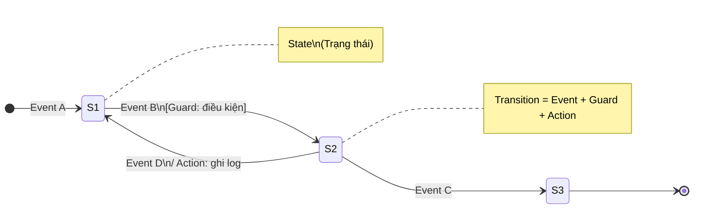

---

## Hình 2.1 – Biểu đồ Use Case (Mục 2.3.1)

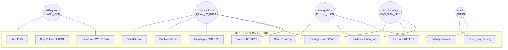

---

## Hình 2.2 – Biểu đồ trạng thái: Luồng chính (Mục 2.3.2)

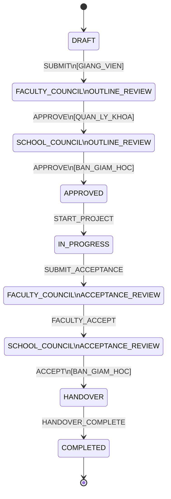

---

## Hình 2.3 – Biểu đồ trạng thái: Luồng phụ và ngoại lệ (Mục 2.3.2)

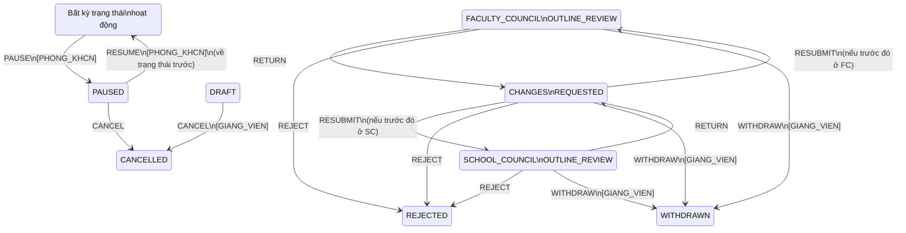

---

## Hình 2.4 – Biểu đồ ERD các bảng chính (Mục 2.3.3)

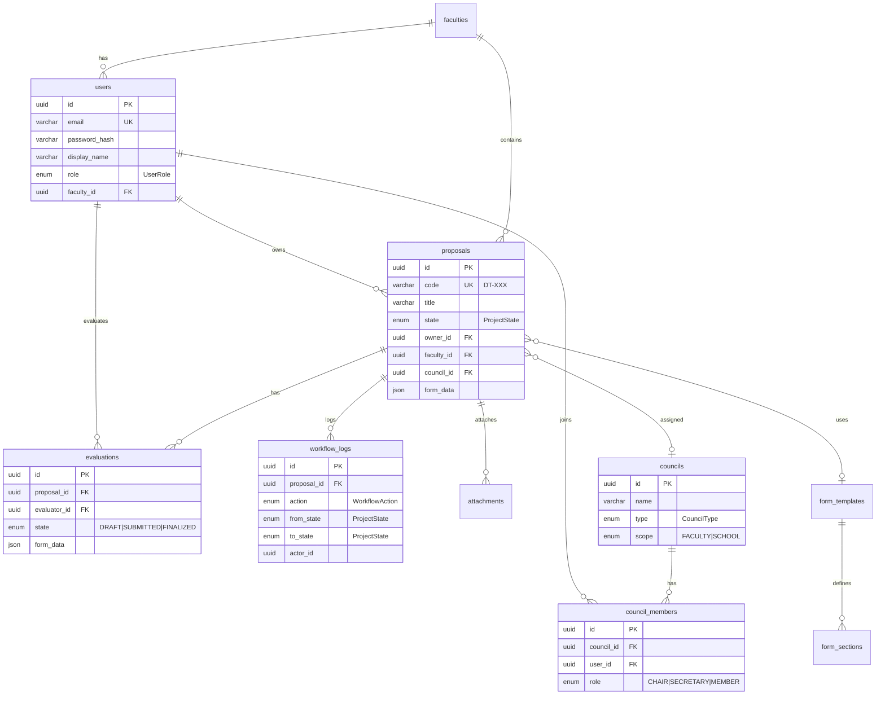

---

## Hình 2.5 – Kiến trúc hệ thống 3 tầng (Mục 2.3.4)

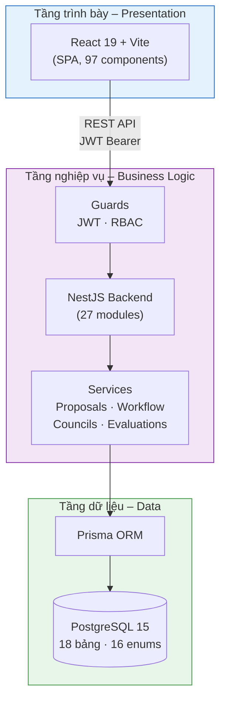

---

## Hình 2.6 – Biểu đồ hoạt động: Quy trình xét duyệt đề cương (Mục 2.3.2)

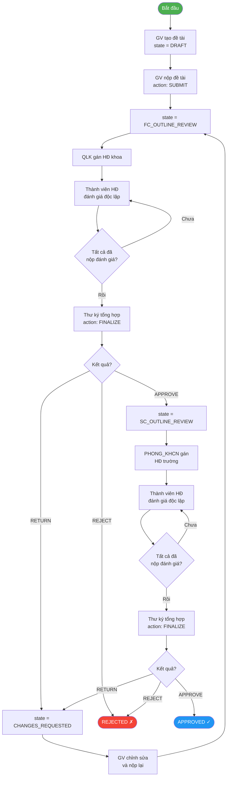

---

## Hình 3.1 – Cấu trúc module Backend (Mục 3.1.2)

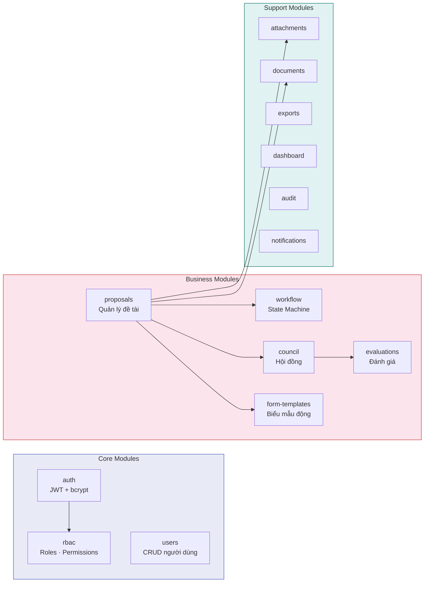

---

## Hình 3.2 – Biểu đồ trình tự: Xét duyệt hội đồng (Mục 3.2.3)

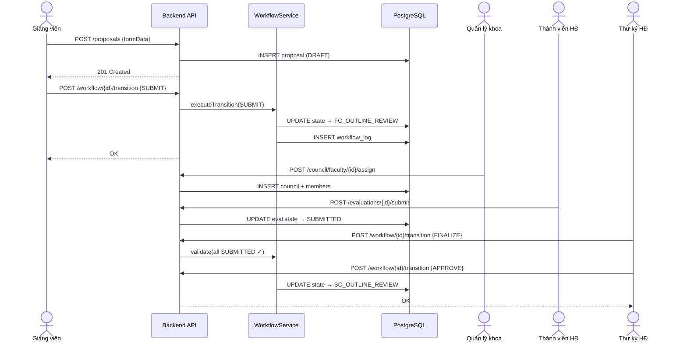

---

## Hình 3.3 – Biểu đồ trình tự: Xác thực JWT (Mục 1.4.1 / 3.2.1)

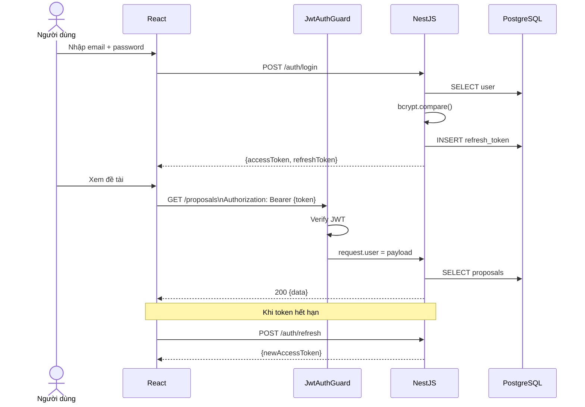

---

## Hình 3.4 – Biểu đồ triển khai Docker (Mục 3.5.1)

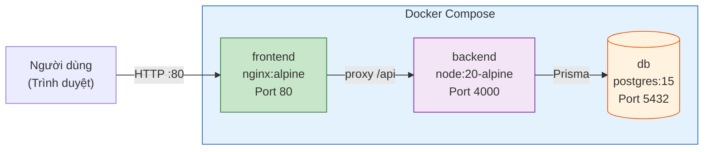

---

## Hình 3.5 – Ma trận phân quyền RBAC (Mục 1.4.2 / 3.2)

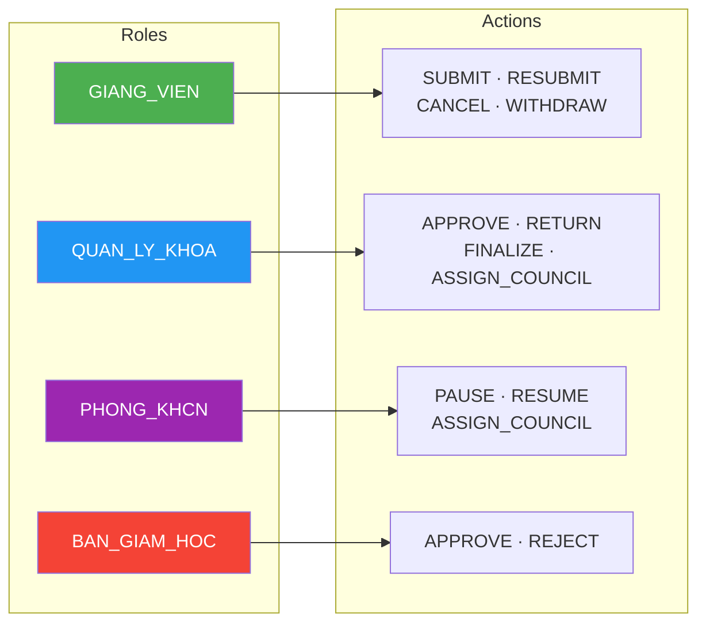

---

## Tổng hợp danh sách hình

| Số hình | Tiêu đề | Mục báo cáo | Trang ước lượng |
|---------|---------|-------------|-----------------|
| Hình 1.1 | Mô hình State Machine tổng quát | 1.2.3 | Chương 1 |
| Hình 2.1 | Biểu đồ Use Case | 2.3.1 | Chương 2 |
| Hình 2.2 | Biểu đồ trạng thái – Luồng chính | 2.3.2 | Chương 2 |
| Hình 2.3 | Biểu đồ trạng thái – Luồng ngoại lệ | 2.3.2 | Chương 2 |
| Hình 2.4 | Biểu đồ ERD các bảng chính | 2.3.3 | Chương 2 |
| Hình 2.5 | Kiến trúc hệ thống 3 tầng | 2.3.4 | Chương 2 |
| Hình 2.6 | Hoạt động: Quy trình xét duyệt đề cương | 2.3.2 | Chương 2 |
| Hình 3.1 | Cấu trúc module Backend | 3.1.2 | Chương 3 |
| Hình 3.2 | Trình tự: Xét duyệt hội đồng | 3.2.3 | Chương 3 |
| Hình 3.3 | Trình tự: Xác thực JWT | 3.2.1 | Chương 3 |
| Hình 3.4 | Triển khai Docker | 3.5.1 | Chương 3 |
| Hình 3.5 | Ma trận phân quyền RBAC | 1.4.2 | Chương 3 |
